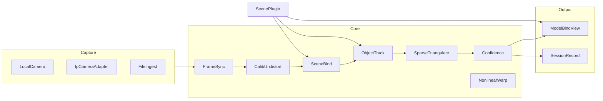

# 鹰眼系统设计大纲

本文是设计大纲，不是实现说明书。协议示例写在文内，不另落 schema 文件。

**文档 vs 项目**：设计可以写全。实现槽未做的路线在本节标 **预留**（阶段、原因）。项目代码只落地当期模块，不建空文件、空类、空插件。预留以本文和协议字段为准，到对应阶段再写实现。

第一版（一期一阶段）：Web 手机摄像头 + 围棋 / 象棋 / 魔方。无本地文件、无 IP 摄像头、无多机对齐、无 App。

---

## 1. 框架设计

### 1.1 引擎与插件

| | 引擎 | 插件 |
|--|------|------|
| 职责 | 能力与框架 | 某一场景的全部具体逻辑 |
| 内容 | 采集、同步、标定/去畸变、观测总线、稀疏三角、置信度、会话、绑定显示、插件加载 | 尺寸与 2D/3D 模型、识别模型、业务（如台球角度推荐）、交互页 |
| 不写死 | 某项运动规则 | — |
| 存放 | 引擎项目内 | **不放进引擎项目**，独立插件仓/目录 |

台球等球类插件为 **待规划**（尺寸、识别模型、业务与交互都在插件仓）。棋牌/魔方同样自带模型、算法、界面，第一版也放在插件仓，由引擎 `PluginLoader` 加载。

同一插件：浏览器用 WASM/WebGPU；App WebView 用原生后端。UI 与观测 schema 不变。

### 1.2 模块图



第一版只启用 `LocalCamera`。`IpCameraAdapter`、`FileIngest`、多机 `FrameSync` 在设计中保留接口，实现槽标预留。

每个运行结果带 `platform` 与 `precision_profile`：`web_basic` / `mobile_std` / `server_std` / `pro`。未实现路线返回 `unsupported`，不删接口描述。

### 1.3 能力深度（不是有无）

| 能力 | Web | 手机 App | 服务 | 第一版 |
|------|-----|----------|------|--------|
| 1～2 路本机摄像头 | 1（手机浏览器） | 1～2 | 1～4+ | Web 1 路 |
| 3 路以上 IP/工业 | 预留 | 预留 | n | 不做 |
| 多机同步 | 预留 | 软同步 | 更高 | 不做 |
| 标定+去畸变 | 做 | 做 | 做 | 棋盘/物体 PnP |
| 场地/盘面特征 | 做 | 做 | 做 | 棋盘/魔方 |
| 非线性扭曲 | 轻度 | 做 | 做 | 纸面透视即可 |
| 球类追踪 | 预留 | 二阶段 | 做 | 不做 |
| 稀疏 3D | 平面假设 | 二阶段三角 | 做 | 魔方姿态即可 |
| 稠密 3D | 预留 | 预留 | 预留 | 不做 |
| 置信度 | 做 | 做 | 做 | 做 |
| 绑定显示 | 做 | 做 | 无头出 JSON | 做 |

### 1.4 运行模式（同一套 Web）

- **浏览器模式**（第一版）：页面用浏览器算力。
- **App WebView**（一期二阶段，预留）：同一套页面，桥接手机采集/NPU，Web 只显示。
- **服务**（二期，预留）：同一引擎进程；实时 HTTP/WebSocket，非实时文件；PC UI 套壳调 loopback。

### 1.5 第一版 Web 插件

| plugin_id | 场景 | 资源 | 算法 | 交互 |
|-----------|------|------|------|------|
| `board.go` | 围棋 | 19 路盘 2D/简单 3D、星位 | 格线、黑白子、落子差 | 盘面叠加、可选 SGF |
| `board.xiangqi` | 象棋 | 9×10 盘、河界 | 格、红黑子分类 | 盘面叠加、FEN 类导出 |
| `cube.colors` | 魔方 | 立方体 glTF、六色 | 色块、姿态 | 展开图/3D、还原步骤可后加 |

`court.badminton` 及乒乓球等球类：**待规划**，不在引擎仓占位，一期二阶段再实现。

---

## 2. 功能模块设计

每个模块：先功能和接口，再三个实现槽。未做的槽标 **预留**。

公共约定：

- 输入输出用观测对象，不直接传平台句柄。
- 失败：`ok: false`，`code` 为 `unsupported` | `low_confidence` | `error`。
- 每条结果含 `module_id`、`module_version`、`platform`、`precision_profile`。

### 2.1 LocalCamera（本机摄像头）

**功能与接口**

- 功能：打开/关闭一路本机相机，按约定分辨率出帧。
- 输入：`{ device_id?, facing: "environment"|"user", width, height, fps }`
- 输出：`Frame { stream_id, frame_index, capture_ts, pixel_format, width, height, buffer_ref }`
- `buffer_ref` 尽量不拷像素。

**实现槽**

- 当前平台：Web `getUserMedia` + `VideoFrame`。第一版只开后置 1 路，建议 1280×720 或 1920×1080 @ 30。
- 网络接口：**预留**（二期）。本机采集不经网络。
- 其他通信：**预留**（一期二阶段）。App 桥 `camera.start/stop/onFrame`。

### 2.2 IpCameraAdapter

**功能与接口**

- 功能：把 IP/ONVIF/FLV/RTSP 收成与 `Frame` 相同的观测。
- 输入：`{ url, protocol, auth, cors_mode }`

**实现槽**

- 当前平台：**预留**（第一版不做 IP）。
- 网络接口：**预留**。后续经同源代理或 MediaMTX。
- 其他通信：**预留**。App 原生拉 RTSP。

### 2.3 FileIngest

**功能与接口**

- 功能：离线视频按时间戳出 `Frame`。
- 输入：`{ uri, start_ms?, end_ms? }`

**实现槽**

- 当前平台：**预留**（第一版不提供用户选文件）。
- 网络接口：**预留**（二期上传分析）。
- 其他通信：**预留**。

### 2.4 FrameSync

**功能与接口**

- 功能：多路 `Frame` 按时间窗配准；单路时原样通过。
- 输入：`Frame[]`，`window_ms`
- 输出：`SyncedBundle { t_ref, frames[], sync_error_ms, dropped[] }`

**实现槽**

- 当前平台：第一版恒等（1 路，`sync_error_ms = 0`）。
- 网络接口：**预留**。服务端按 `capture_ts` 配准。
- 其他通信：**预留**。一期二阶段软同步 / NTP。

### 2.5 CalibUndistort

**功能与接口**

- 功能：内参、外参、去畸变；无棋盘时用场景模型 PnP。
- 输入：`Frame` + `ScenePack` 或棋盘观测
- 输出：`CameraState { K, dist, R, t, reproj_err, method }`
- `method`：`chessboard` | `scene_pnp` | `identity`

**实现槽**

- 当前平台：第一版 `scene_pnp`（棋盘格/魔方棱）。`identity` 作回退。完整 Brown 去畸变 **预留**。
- 网络接口：**预留**。重标定可交服务。
- 其他通信：**预留**。App 可跑 OpenCV 原生标定。

### 2.6 SceneBind

**功能与接口**

- 功能：把图像特征绑到场景包关键点，得到 2D-3D 对应和单应/姿态。
- 输入：`Frame`、`CameraState`、`ScenePack`
- 输出：`ScenePose { keypoints[], H_or_T, confidence }`
- 关键点 ID 由插件定义（如 `go.star.d4`、`cube.face.U.sticker.00`）。

**实现槽**

- 当前平台：第一版由 `board.go` / `board.xiangqi` / `cube.colors` 提供检测，引擎只做对应与 PnP。
- 网络接口：**预留**。
- 其他通信：**预留**。

### 2.7 ObjectTrack

**功能与接口**

- 功能：在已绑定场景上追踪物体（子、色块、球）。
- 输入：`Frame`、`ScenePose`、插件模型
- 输出：`Observation[] { track_id, class, uv, xyz?, conf, occluded }`

**实现槽**

- 当前平台：第一版棋子/色块；球类 **预留**。
- 网络接口：**预留**。二期可把帧或裁块送到 EAS。
- 其他通信：**预留**。App NPU 跑同一观测 schema。

### 2.8 SparseTriangulate

**功能与接口**

- 功能：多视三角；单机时用平面或物体刚体约束出 `xyz`。
- 输入：`SyncedBundle`、各路 `Observation`、`CameraState[]`
- 输出：`Point3D[] { id, xyz, cov, views_used }`

**实现槽**

- 当前平台：第一版围棋/象棋用盘面 z=0；魔方用立方体姿态，不是多视三角。
- 网络接口：**预留**。
- 其他通信：**预留**。一期二阶段 2 机三角。

### 2.9 Confidence

**功能与接口**

- 功能：综合检测分、重投影误差、时间连续性（后续再加多机一致性）。
- 输出：写回各观测的 `confidence` 与 `flags[]`

**实现槽**

- 当前平台：第一版做检测分 + 重投影 + 简单平滑残差。
- 网络接口：无独立网络形态，随观测走。
- 其他通信：同左。

### 2.10 NonlinearWarp

**功能与接口**

- 功能：纸张等非线性扭曲的识别、绑定、拉平。
- 输入：`Frame`、网格控制点
- 输出：`WarpField` + 拉平图 `buffer_ref`

**实现槽**

- 当前平台：第一版棋盘用透视即可；薄板样条等 **预留**。
- 网络接口：**预留**。
- 其他通信：**预留**。

### 2.11 ModelBindView

**功能与接口**

- 功能：把 `ScenePose` 与 `Point3D` 画到标准 2D/3D 模型上。
- 输入：观测 + `ScenePack.model`
- 输出：显示命令，不规定 UI 框架

**实现槽**

- 当前平台：第一版 Vue 叠加 + 可选 Three.js。
- 网络接口：无头服务 **预留**，只出 JSON/glTF。
- 其他通信：App 仍用同一套 Web 页。

### 2.12 SessionRecord

**功能与接口**

- 功能：写会话文件，记录谱系（哪端、哪模块、精度）。
- 输出：见第 3 节 `*.eye.json`

**实现槽**

- 当前平台：第一版浏览器下载或内存导出 JSON（不含原视频）。
- 网络接口：**预留**。二期 POST 会话。
- 其他通信：**预留**。

### 2.13 PluginLoader

**功能与接口**

- 功能：按 `plugin_id` + `plugin_version` 加载场景包与 UI；按插件配置决定调用哪套实现、是否加载对应模块。
- 插件实现：`detect(frame, scene) -> Observations`，以及可选 `logic()`、`view()`。
- 引擎能力对插件的调用名：`{module}.{func}`，可选后缀指定实现。

**实现选择（后期实现，第一版可写进配置但不做路由）**

优先级默认 **后台 > App > Web**（有则用更强的，没有再降级）。

| 写法 | 行为 |
|------|------|
| `module.func` | 智能：按后台 > App > Web 选当前可用且已加载的最强实现 |
| `module.func.web` | 强制 Web |
| `module.func.app` | 强制 App |
| `module.func.backend` | 强制后台（服务端） |

插件用配置声明用哪些资源，控制运行时行为，并告诉引擎要不要加载该实现（未选中的实现不加载，避免空模块占资源）：

```json
{
  "runtime": "auto",
  "allow": ["backend", "app", "web"],
  "modules": { // 后面排期
    "ObjectTrack.detect": "auto",
    "CalibUndistort.undistort": "web"
  }
}
```

- `runtime: "auto"`：未点名的 `module.func` 走优先级。
- `allow`：本插件允许的实现池；不在池内的实现引擎不加载。
- `modules` 里写死 `web` / `app` / `backend` 则等同 `module.func.web` 等，不再智能降级。// 后面排期

**实现槽**

- 当前平台：第一版从独立插件仓加载 `board.go` / `board.xiangqi` / `cube.rubik`，引擎内不存放场景资源；实现选择按上面配置，本期可忽略，一律走 Web。
- 网络接口：**预留**。远程插件包；`module.func.backend` 走 HTTP/WebSocket。
- 其他通信：**预留**。App 加载同一 `plugin_id`；`module.func.app` 走 WebView 桥。

---

## 3. 协议设计

数据、文件、通信均带 `protocol_version`。插件包以 **引擎版本** 判断能否加载（该引擎版本已绑定插件 SDK/协议）；`manifest` 里仍保留 `protocol_version` 作对照，不影响加载逻辑。每个 **软件版本** 带一份模块版本清单。可扩展字段放 `extensions`，不为 Web 砍服务端字段。

当前草案：`protocol_version = "0.1.0"`。不兼容变更升主版本。

### 3.1 软件版本清单

```json
{
  "protocol_version": "0.1.0",
  "software": {
    "name": "play-eye",
    "version": "0.1.0",
    "channel": "web_basic"
  },
  "modules": {
    "LocalCamera": "0.1.0",
    "FrameSync": "0.1.0",
    "CalibUndistort": "0.1.0",
    "SceneBind": "0.1.0",
    "ObjectTrack": "0.1.0",
    "SparseTriangulate": "0.1.0",
    "Confidence": "0.1.0",
    "ModelBindView": "0.1.0",
    "SessionRecord": "0.1.0",
    "PluginLoader": "0.1.0"
  },
  "plugins": {
    "board.go": "0.1.0",
    "board.xiangqi": "0.1.0",
    "cube.colors": "0.1.0"
  },
  "models": {},
  "platform": "web",
  "precision_profile": "web_basic"
}
```

未实现模块不要写进已发布软件的 `modules` 清单；只留在设计文档。

### 3.2 数据协议（观测）

```json
{
  "protocol_version": "0.1.0",
  "type": "observation",
  "t": 1710000000123,
  "plugin_id": "board.go",
  "items": [
    {
      "id": "stone.d4",
      "class": "black_stone",
      "uv": [0.42, 0.37],
      "xyz": [3.0, 3.0, 0.0],
      "confidence": 0.86,
      "provenance": {
        "platform": "web",
        "precision_profile": "web_basic",
        "module_id": "ObjectTrack",
        "module_version": "0.1.0"
      }
    }
  ],
  "extensions": {}
}
```

### 3.3 文件协议（会话）

逻辑名 `*.eye.json`。第一版不附 `media/`。后续若附媒体，目录与 JSON 同级，JSON 里只存相对路径。

```json
{
  "protocol_version": "0.1.0",
  "software": { "name": "play-eye", "version": "0.1.0" },
  "modules": { "ObjectTrack": "0.1.0" },
  "plugins": { "board.go": "0.1.0" },
  "created_at": "2026-08-15T00:00:00Z",
  "platform": "web",
  "precision_profile": "web_basic",
  "cameras": [
    {
      "stream_id": "cam0",
      "source": "local",
      "width": 1280,
      "height": 720,
      "K": null,
      "dist": null,
      "R": null,
      "t": null
    }
  ],
  "scene": { "plugin_id": "board.go", "plugin_version": "0.1.0" },
  "tracks": [],
  "keypoints": [],
  "sync": { "error_ms": 0 },
  "media": [],
  "extensions": {}
}
```

标定块字段名与 OpenCV YAML 对齐：`K` / `dist` / 分辨率，便于互导。

### 3.4 场景包（插件）

逻辑名 `scene.pack`（目录或 zip）。资源在 **插件项目** 内，不进引擎仓。引擎已部署后仍可增加打包插件：把包放到插件目录或给 URL，`PluginLoader` 读 `manifest.json` 再加载，不必改引擎工程、也不必为每个插件重发引擎。纯 Web 用 `fetch` 拉包（需 CORS/CSP）；App/服务下载到本地后加载。随 Web 应用静态打包只是第一版省事，不是唯一方式。

包内是完整场景，不是单项能力（例如标准三阶魔方，而不是「认颜色」）。至少包括：

| 内容 | 说明 |
|------|------|
| 尺寸与 2D/3D 模型 | 场地/桌面规则尺寸、`scene.json`、`model.glb` |
| 识别模型 | 如台球球号 ONNX，放 `assets/` |
| 算法 | 检测、位姿、走位等 |
| 业务逻辑 | 如击球、角度推荐 |
| 交互页面前端脚本 | 叠加、点选、推荐线 |
| 后端逻辑 | 有服务时由服务端 PluginLoader 调用；无服务则在 Web/App 本地跑同一套业务 |

引擎不写具体运动规则，只加载并走约定接口。

另有 **插件模板项目**（独立于引擎、也不是某个场景包）：提供插件工程骨架，约定目录、`manifest`、打包成 `scene.pack` 的方式。模板负责 **联系引擎与插件**——封装 `PluginLoader` 的加载契约，并把引擎已有能力以 SDK/方法暴露给插件（如取帧、标定、观测总线、会话写入、绑定显示）。具体场景插件从模板复制/继承后，只填本场景的模型、算法、业务、UI 和后端逻辑，不直接改引擎。

```text
scene.pack/
  manifest.json      # engine_version, plugin_id, plugin_version；protocol_version 仅注释对照
  scene.json         # 坐标系、规则尺寸、关键点 ID
  model.glb          # 可选
  keypoints.json
  assets/            # 贴图、检测权重（onnx 等）
  algo/              # 算法
  logic/             # 业务 + 可选后端逻辑
  ui/                # 交互页面前端脚本
```

`manifest.json` 示例：

```json
{
  "protocol_version": "0.1.0", // 插件协议版本 注释说明用
  "engine_version": "0.1.0", // 引擎主版本
  "plugin_id": "board.go",
  "plugin_version": "0.1.0" // 插件自生版本
}
```

`units`、`board_size` 等场景尺寸写在 `scene.json` 或业务/模型文件里，不放 `manifest` 根节点。`scene.json` 示例：

```json
{
  "units": "mm",
  "board_size": 19
}
```

加载只认 `engine_version`。引擎发版时已绑定插件系统版本（SDK、`PluginLoader` 契约、`protocol_version`）。`manifest.protocol_version` 与该引擎对应的协议号对齐，供人眼对照，**不参与**能不能装的判断。会话/观测里的 `protocol_version` 仍由当时运行的引擎写出。

### 3.5 通信协议

- 控制：REST。例：`POST /v0.1/session`，路径含主协议版本。
- 实时：WebSocket，每条 NDJSON，头字段 `protocol_version`、`type`（`hello` | `observation` | `heartbeat` | `error`）。
- 媒体与结果分离：第一版不上行视频。二期有服务器时相机直推服务，终端只收观测。

```json
{
  "protocol_version": "0.1.0",
  "type": "heartbeat",
  "t": 1710000000123,
  "software_version": "0.1.0"
}
```

第一版可不上网，观测只在页内总线走；REST/WS 字段仍按上面设计，实现槽标 **预留**。

### 3.6 带宽

边缘出观测（每帧数 KB）。原流只在服务需要时短时上高清（二期）。

---

## 4. 项目规划

### 4.1 仓库（规划，未落地）

```text
golden-pupils/                         # 本仓：Web 壳 + 文档 + 日后 schema（不含场景插件）
  app/pages/eye/                   # 一期一阶段再创建
  app/utils/eye/
  packages/eye-schema/             # 实现时再从本文示例抽出
  support/eye-engine/              # 引擎：加载器与能力，不含场景/插件资源
  doc/鹰眼/
    鹰眼-research.md
    鹰眼-design.md

eye-plugin-template/               # 另仓：插件工程模板，暴露引擎能力/方法
eye-plugins/                       # 另仓：场景插件（从模板出；围棋/象棋/魔方第一版；其余待规划）
eye-android/                       # 另仓，一期二阶段
eye-pc/                            # 另仓，二期 Web 套壳
```

现有 Nuxt `app/` + `support/` 旁路服务可保留。鹰眼 CV 不进 Nuxt server。场景与插件不放进引擎项目。

### 4.2 三期

| 阶段 | 做什么 | 不做什么 |
|------|--------|----------|
| 一期一阶段（第一版） | 引擎模块/协议；独立插件仓落地围棋/象棋/魔方；1 路手机摄像头 | 文件、IP、多机、App、球类 |
| 一期二阶段 | 多机软同步；App WebView 用手机算力 | 专业高速机；羽毛球场景插件开始 |
| 二期 | 服务 + PC UI；文件离线可在此引入；云 EAS 按需 | 稠密 3D |
| 三期 | 同步/相机/精度向专业靠拢 | — |

### 4.3 两档产品

- **基础档**：1 机，Web 离线棋牌/魔方（第一版）。
- **标准档**：2 机，软同步，稀疏 3D，App/PC+服务（二阶段起）。

### 4.4 第一版项目里应有的模块（避免空壳）

引擎仓只实现：`LocalCamera`（Web）、恒等 `FrameSync`、`CalibUndistort`（scene_pnp）、`SceneBind`、`ObjectTrack`、平面 `SparseTriangulate`、`Confidence`、`ModelBindView`、`SessionRecord`、`PluginLoader`。

插件仓第一版：`board.go` / `board.xiangqi` / `cube.colors`。乒乓球及其他场景 **待规划**，不在引擎仓占位。

不要在引擎仓创建：IP 适配器、文件导入、多机同步实现、任何场景资源/插件、空的服务目录。
